# Fashion_recommender
The Fashion_recommender (FR) system recommends similar items to the buyers based on the input item.

The dataset used in this project is [Fashion-MNIST](https://github.com/zalandoresearch/fashion-mnist), an extremely popular dataset to verify machine learning algorithms. The methodology proposed in this work includes hand-crafted features extraction based on traditional image processing algorithms, along with machine learning algorithms to classify the obtained features. The final results of the proposed method reach a promising accuracy of 82%, which is acceptable with hand-crafted feature extrator. Besides, Deeplearning method is also used as a reference to evaluate the proposed method. To visualize the results of the FR system, we randomly choose an image in the dataset, use the proposed method to predict its class (genres), and perform feature matching to find k-nearest items in its class. The details regarding dataset, methodology, results/dicussion and conclusion are as follows:

# Table of Contents
1. [Usage](#para1)
    1. [Quick Trial](#sub1.1)
    2. [Installation](#sub1.2)
3. [Dataset](#para2)
4. [Methodology](#para3)
    1. [Hand-crafted feature extraction](#sub2.1)
    2. [Machine learning algorithm](#sub2.2)
    3. [Deep learning](#sub2.3)
    4. [Visual validation](#sub2.4)
5. [Results and Discussion](#para4)
6. [Conclusion](#para5)
7. [Authors](#para6)

# Usage <a name="para1"></a>
## Quick Trial <a name="sub1.1"></a>

For a quick trial of the proposed algorithm, you could access to this [Google Colab link](https://colab.research.google.com/drive/1XfNOKrnBJGANySVfm6XVybkOMG7aW6cr?usp=sharing) . All required libraries and environments has been pre-installed. You could run 1 cell at a time to keep track of the flow of the algorithm, or Run-All to run all cells and wait until it outputs the final results.

This quick trial setup is highly recommended for those, who couldn't afford strong computer as running the algorithm is rather resource-consuming and time-consuming. Google Colab provides users with decent CPU and even GPU for free, the only drawback is it has quite strict limitation on GPU use time, but it is still sufficient for this task. 

## Installation <a name="sub1.2"></a>

The other way to try on this algorithm is to install it in your computer. The setps are simple, you only have to clone/download this git, install required libraries, extract `data.rar` and run the `main.py` file

# Dataset <a name="para2"></a>

[](git_img/fashion-mnist-sprite.png)

The dataset used in this project is [Fashion-MNIST](https://github.com/zalandoresearch/fashion-mnist). The initial `Fashion-MNIST` dataset has `idx-ubyte.gz` format, so I used `data_preprocessing.py` file to extract and rearrange the dataset in `jpg` format (You can find it in the `./data/test_original_size` and `./data/test_original_size` folder. The original size of each image is 28x28 pixels. Each pixel value is in the uint8 format and has the intensity range of 0-1.

At first, I tried feature extractor algorithms on the default Fashion-MNIST dataset but it failed because of the size and intensity range. Therefore, I have to scale-up the images to 10 times (280x280 pixels) and intensity range to 0-255. One more thing to notice, because of the limitations in hardware resource, I only use 9000 images in the `./data/test/` folder for training and the other 1000 for testing. Here is the [link](https://drive.google.com/file/d/1keVA3yja2c8vGFZDQRUNK4QpDU4_PfSn/view?usp=sharing) of the processed dataset in this work.

In addition, the label of the dataset is as the table below:
|Label  | Description|
|-------|------------|
|0      |T-Shirt/Top |
|1      |Trouser     |
|2      |Pullover    |
|3      |Dress       |
|4      |Coat        |
|5      |Sandal      |
|6      |Shirt       |
|7      |Sneaker     |
|8      |Bag         |
|9      |Ankle boot  |

# Methodology <a name="para2"></a>
## Hand-crafted feature extraction <a name="sub2.1"></a>

There are a bunch of Hand-crafted feature extraction in the image processing world, and the most popular is `SIFT` and `SURF` algorithm. Sadly, both the authors of the algorithms claim license on their product, therefore these algorithms are no longer available for free now. Fortunely, some state-of-the-art algorithms came to the rescue as an equivalent to the licensed `SIFT` and `SURF` algorithms such as ORB, BRISK, KAZE and so on. The reference is from [this link](https://dsp.stackexchange.com/questions/1288/what-are-some-free-alternatives-to-sift-surf-that-can-be-used-in-commercial-app#:~:text=BRISK%20(includes%20a%20descriptor),descriptor%20(modified%20fast%20binary%20descriptor)). 

With the fundamental idea that an image is actually a matrix of pixels, and that matrix is constructed from a number of features, we could therefore represent an image by its set of features, instead of looking at the whole image. Thus, the ultimate goal of Hand-crafted feature extraction algorithm is to encode an image into a set of vectors (or features). In order to do that, most algorithms folow 2 phases: `Keypoint detector` and `Keypoint descriptor`. 

The `Keypoint detector` phase ouputs a number of points, which is considered an outstanding point or keypoint to represent the whole image. In addition, the `Keypoint descriptor` phase outputs a histogram of directions for each keypoint. Based on the histogram, we know the direction and magnitude specific to that keypoint.

In this project, I decided to use the `A-KAZE` algorithm, which is currently the fastest and most effective hand-crafted feature extrator available free of charge. In short, `A-KAZE` basically follows the 2 phases above with some improvements to increase speed and accuracy. It's the accelerated version of KAZE (which uses M-SURF feature descriptor and modified for nonlinear space), free of charge and uses M-LDB descriptor (modifed fast binary descriptor). An example of the ouput of Hand-crafted feature extraction using `AKAZE` on our data is as below:

This is a piece of code for feature extraction
```bash
# Decode images into vectors
akaze = cv2.KAZE_create()
for image in tqdm(train_image_list):
    img = cv2.imread(image)
    
    kp, des = akaze.detectAndCompute(img, None)
    for d in des:
        All_vector.append(d)
```

And this is some of the results

[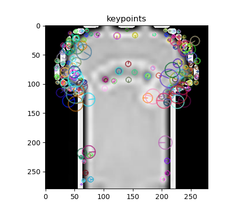](git_img/Figure_1.png)
[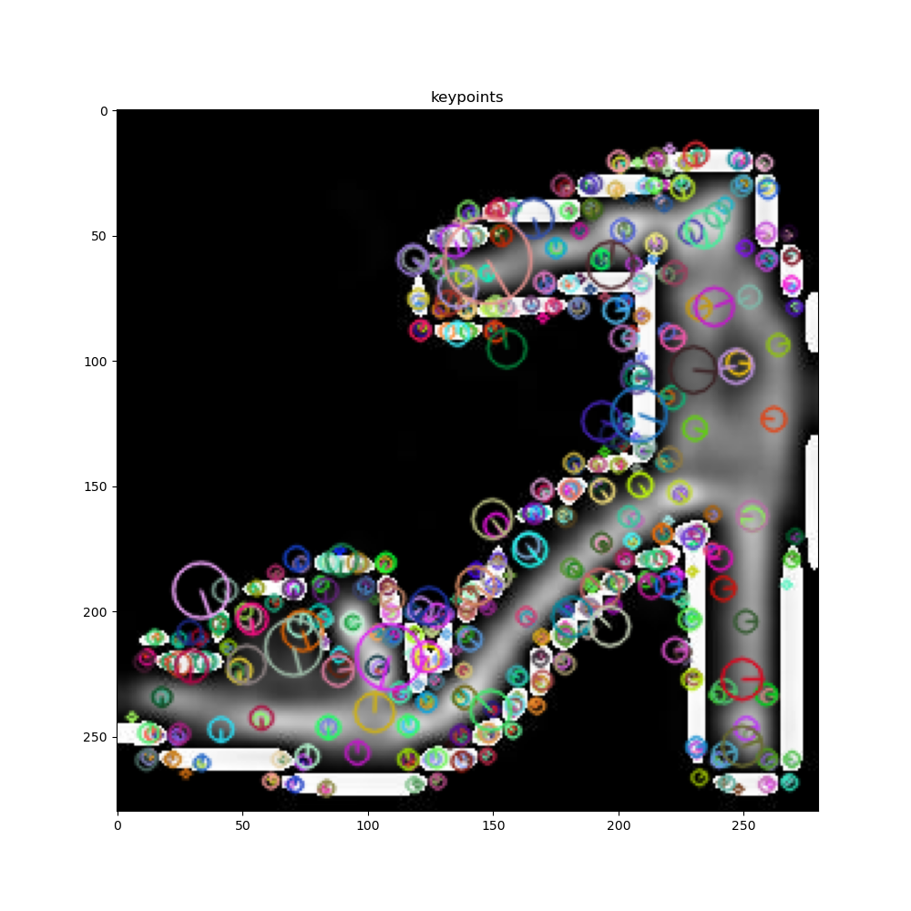](git_img/Figure_2.png)
[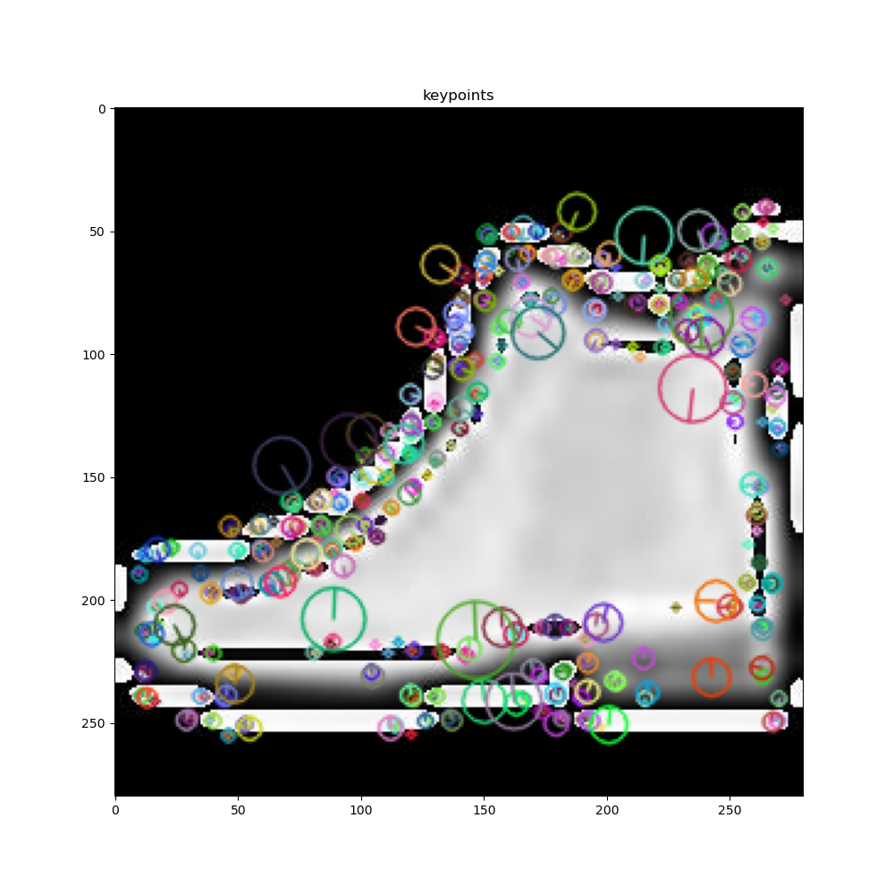](git_img/Figure_3.png)
[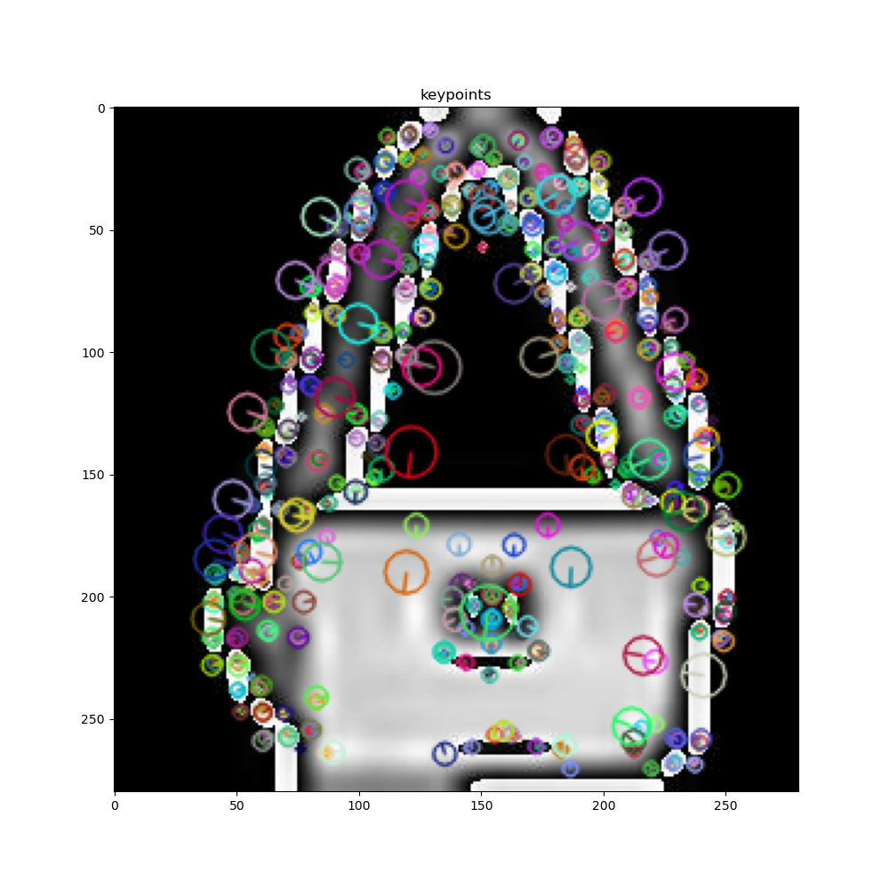](git_img/Figure_4.png)

## Machine learning algorithm <a name="sub2.2"></a>

After obtaning the vectors of feature of each image in the dataset, the next step is to use `K-nn clustering` algorithm to divide the features into many clusters. The number of clusters is user-defined by changing the `word_num` variable. The line of code of the task is as follows:

```bash
# Clustering vectors 
kmeans = MiniBatchKMeans(n_clusters=word_num, batch_size=batch, verbose=0).fit(All_vector)
```
The next step is to assign appropriate clusters to features of each train and test image. And the final step is use `SVM algorithm` to perform the classification task. Note that there might be several kinds of featues, such as color, shape, texture, ... but in this project, we use only keypoint as texture feature and the result actually proves that it is sufficient. The SVM parameters are set as follows (regularization parameter = 5, kernel = 'rgf', gamma = 'scale'):

```bash
classifier = SVC(C=5, kernel='rbf', gamma='scale')
classifier.fit(X,Y)
```
## Deep learning <a name="sub2.3"></a>

We tried solving the problem using Deep learning method to compare the performance of the proposed method with the state-of-the-art models. From the comparision, we expect to have a sense how our proposed method performs as compared with the deeplearning standard (the highest standard nowadays). Over the past decade, with the rapid advancement of computer hardware, deep learning showed its appearance in every corner of life and proved its superiority as compared with classical methods. Popular deep classification models include Alexnet, VggNet, ResNet, MobileNet, ... with the increasing accuracy and decreasing size through time. In this work, we choose VggNet to predict the class and compare its accuracy against the proposed BoW method.

The structure of the VGG11 net used in this work is illustrated in the figure below:

[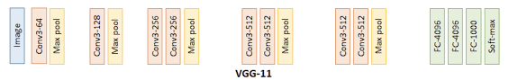](git_img/vgg11.png)

The Vgg11 has similar structure as compared with the original Vgg16 model with redundant from 16 layers to 11 layers. In short, the model has convolutional layers for feature extraction and pooling layers for reducing feature map size. The input of Vgg11 has the size (224,224,3) as default from the original paper. The Vgg model in this work has been pretrained on ImageNet dataset with output of 1000 classes. Therefore, before training or infering using the model, we need modify the model structure by replacing the classification layer with 1000 output by 10 output to fit our FashionMNIST dataset. The code for model structure modification is as follows:

```bash

# This function is used to tell the optimizer not to update params in the freeze layer 
# Only use in freeze mode
def set_parameter_requires_grad(model, feature_extracting):
    if feature_extracting:
        for param in model.parameters():
            param.requires_grad = False
            
# Init model and customize from the pretrained version in Pytorch
model = models.vgg11_bn(pretrained=pretrained).cuda()
set_parameter_requires_grad(model, feature_extract)
num_ftrs = model.classifier[6].in_features
model.classifier[6] = nn.Linear(num_ftrs,num_classes)
```

In order to achieve the best performance on our FashionMNIST dataset, we tried 3 modes of VggNet:
- Freeze the classification layer and keep the feature extraction layer
- Train all parameters of the model from scratch
- Finetune all parameters of the model based on pretrained weight of ImageNet dataset.

The accuracy and training progress of 3 modes is shown in the table and graph below:

|Freeze  |Scratch    |Finetune|
|--------|-----------|--------|
|84%     |93%        |94%     |

Freeze mode: 

[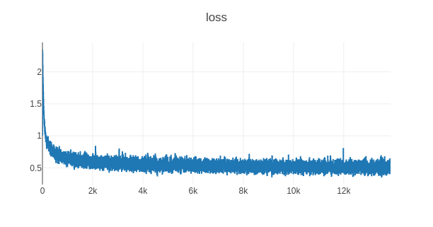](git_img/freezeLayer.png)

Scratch mode: 

[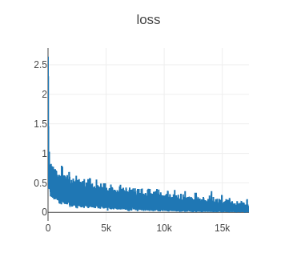](git_img/scratch.png)

Finetune mode: 

[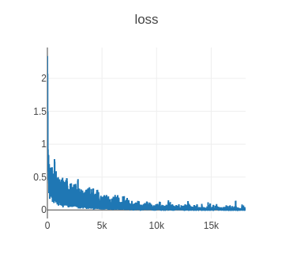](git_img/finetune.png)

In freeze mode, we need the `set_parameter_requires_grad` function to set the `require_grad` of the freeze layer to False. The advantage of this mode is quick convergence, reusable of the pretrained feature extraction layer and few parameters to train. However, this method depends heavily on the compatibility between the pretrained dataset and the user dataset. In this work, the freeze method shows the least accuracy due to the relative incompatibility of ImageNet dataset and FashionMNIST dataset. However, it still performs slightly better than the proposed hand-crafted feature method (84% as compared with 82%). In case we train the model from scratch, the accuracy reachs 93%. Meanwhile the finetune mode shows the best preformance with 94% accuracy and it also converges faster than scratch method. The accuracy evaluation method is k-top ranking method, which is represented above in the BoW method section.

## Visual validation <a name="sub2.4"></a>

To visually validate the FR system, we randomly choose an image from the Fashion-MNIST dataset as user-input to the proposed method. The proposed method will predict the class of the user-input item. Then, the input image is compared with every single image in the predicted class to determine k-nearest images (k images that have the most matched feature with the input image).

# Results and Discussion <a name="para4"></a>

I ran this project using my PC with the configuration as follows:
|CPU    |GPU    |VRAM   |RAM    |
|-------|-------|-------|-------|
|Dual Xeon E5-2678v3|RTX 3060|12GB|32GB|

Regarding the runtime, it takes roughly 1 hour to finish the running while using Google Colab takes nearly 2,5 hours to complete the running, which is significantly slower.

Regarding the accuracy, the system has an accuracy of nearly 82% after validation. The accuracy is calculated by the following formula (number of corrected predictions  / number of prediections):
```bash
accuracy = sum(res==Y_test)/len(Y_test)
```
Here are some of the successful results:

Input image 1:

[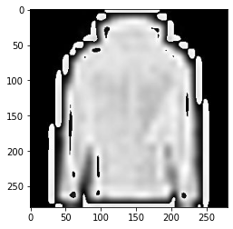](git_img/result_class_4_quiery.png)

K-top results:

[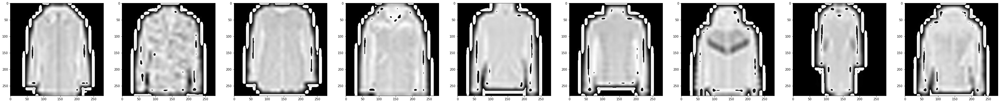](git_img/result_class_4.png)

Input image 2:

[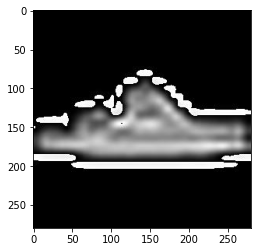](git_img/result_class_5_quiery.png)

K-top results:

[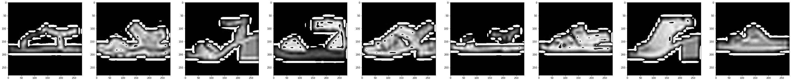](git_img/result_class_5.png)

Input image 3:

[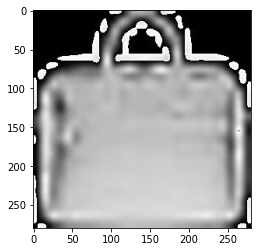](git_img/result_class_9_quiery.png)

K-top results:

[](git_img/result_class_9.png)

# Conclusion <a name="para5"></a>

We are well aware that our approach is still far from perfect, and the accuracy is still have a major distance as compared with Deeplearning-based methods. However, our methodology has promising selling points such as light-weight, fast, need only 1 input item from the customers (no need to track shopping habit) with decent accuracy of 82%. Our next work would be dealing with larger dataset of fashion items and find a way to improve the feature extraction efficiency.

# Authors <a name="para6"></a>

The authors and collaborators of this project include:
- Phạm Xuân Lộc - 20025057 - xuanloc97ars@vnu.edu.vn
- Nguyễn Đức Tiến - 20025061
- Phạm Tiến Mạnh - 21025115

The Univeristy of Engineering and Techonology - Vietnam National University (UET-VNU) </br>
Course: Computer Vision </br>
Lecturer: Dr Nguyễn Hồng Thịnh
